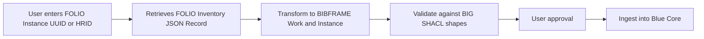

# FOLIO to Blue Core Technical Services Workflow

A demonstration of using an AI agentic harness (e.g. Claude Code) to drive a library
technical services workflow: pulling a cataloging record out of a
[FOLIO](https://www.folio.org/) ILS, transforming it into
[BIBFRAME](https://www.loc.gov/bibframe/) linked-data records, validating them against
the [BIBFRAME Interoperability Group](https://github.com/bf-interop) SHACL shapes, and
ingesting the result into a [Blue Core](https://github.com/blue-core-lod) datastore.

This repo is presentation material, not a production application — the actual
workflow is defined as four agent **skills** in `skills/`, meant to be run in
sequence by an agent rather than as application code:

1. **`folio-inventory-retrieval`** — look up a FOLIO Instance (by UUID, HRID, or
   title/author search) and retrieve its Instance + Holdings JSON via the FOLIO
   Inventory and Search APIs.
2. **`bibframe-transformation`** — reverse the FOLIO→BIBFRAME field mappings used by
   the [bluecore-workflows](https://github.com/blue-core-lod/bluecore-workflows)
   project to turn that FOLIO JSON into BIBFRAME Work and Instance JSON-LD, saved
   alongside a Turtle serialization.
3. **`bibframe-validation`** — validate the Work and Instance graphs separately against
   the BIBFRAME Interoperability Group (BIG) SHACL shapes bundled in the skill's
   `assets/`, using `scripts/validation.py` (a CLI port of the BIG
   [bf-demo-validation-tool](https://github.com/bf-interop/bf-demo-validation-tool)
   built on `pyshacl`). The report is shown to the user, who decides whether to
   proceed — these shapes describe interoperability expectations, not Blue Core
   ingestion requirements, so a non-conformant graph is not automatically a blocker.
4. **`blue-core-mcp-ingestion`** — push the resulting BIBFRAME records into a Blue
   Core datastore via its MCP endpoint (`scripts/blue_core_mcp.py` bridges the
   agent's stdio MCP transport to Blue Core's HTTP MCP server, injecting a
   Keycloak bearer token). The Work is created first, then the Instance with its
   `bf:instanceOf` repointed at the Work URI the server returned.

Each stage writes to `output/{hrid}/`, so the artifacts of a run are inspectable:

```
output/a13616108/
├── instance.json                    # 1. FOLIO Inventory Instance
├── holdings.json                    # 1. FOLIO Holdings
├── bf_work.jsonld / bf_work.ttl     # 2. BIBFRAME Work
├── bf_instance.jsonld / .ttl        # 2. BIBFRAME Instance
├── work_create_response.json        # 4. Blue Core create response
└── instance_create_response.json    # 4. Blue Core create response
```

## Workflow Diagram


## A note on the skill directories

`skills/` and `.claude/skills/` are **hardlinked to the same inodes** — `.claude/skills/`
is what the agent harness discovers, `skills/` is what git tracks (`.claude/*` is
gitignored). Editing either path edits both. Beware of applying the same in-place
transformation to both paths in one pass, since it will be applied to the same file twice.

See `AGENTS.md` for setup instructions and guidance on how an agent should work
with this repo.
